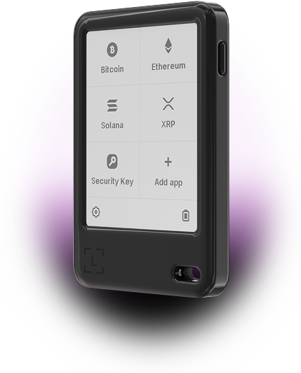

# Create Your Ledger App

Ledger devices support apps written in **C** or **Rust**. Both start from an
official boilerplate that includes :

* APDU handling examples,
* Swap feature example,
* UI flows,
* Functional tests,
* Required CI workflows and more.

[Create C App](command:ledgerDevTools.newCApp) &nbsp;&nbsp; [Create Rust App](command:ledgerDevTools.newRustApp)

## Reference

- [App Boilerplates guide](https://developers.ledger.com/docs/device-app/integration/how-to/app-boilerplate)
