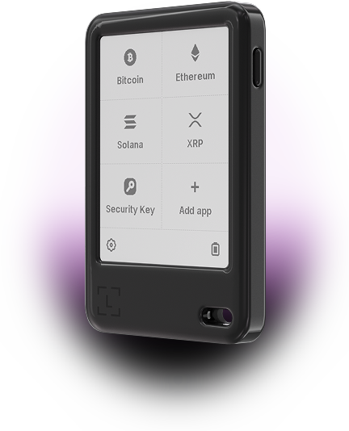

# Build Your Ledger App in Rust

Rust is the language of choice for new Ledger device apps. Memory-safe, built for embedded security and fully supported by our official boilerplate:

* APDU handling examples,
* Swap integration example,
* UI flows,
* Functional tests,
* Required CI workflows and more.

[Create Rust App](command:ledgerDevTools.newApp)

> Maintaining an existing C app? The [C boilerplate](https://github.com/LedgerHQ/app-boilerplate) is kept as a reference.

## Reference

- [App Boilerplates guide](https://developers.ledger.com/docs/device-app/integration/how-to/app-boilerplate)
