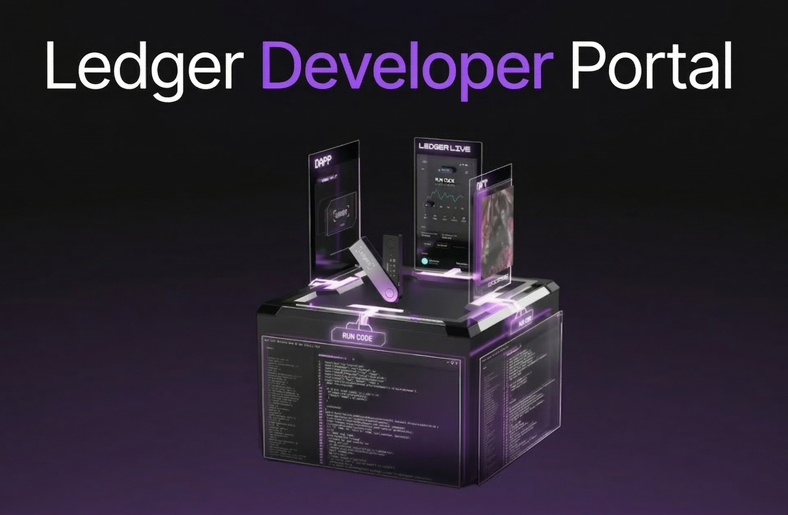

# Learn More

The [Ledger Developer Portal](https://developers.ledger.com/docs/device-app/getting-started) is the
primary resource for learning about Ledger device apps development — from
cryptography requirements to UI guidelines and the security audit process.

For a description of what this extension provides, see the
[extension README](https://github.com/LedgerHQ/ledger-vscode-extension/blob/main/README.md).
